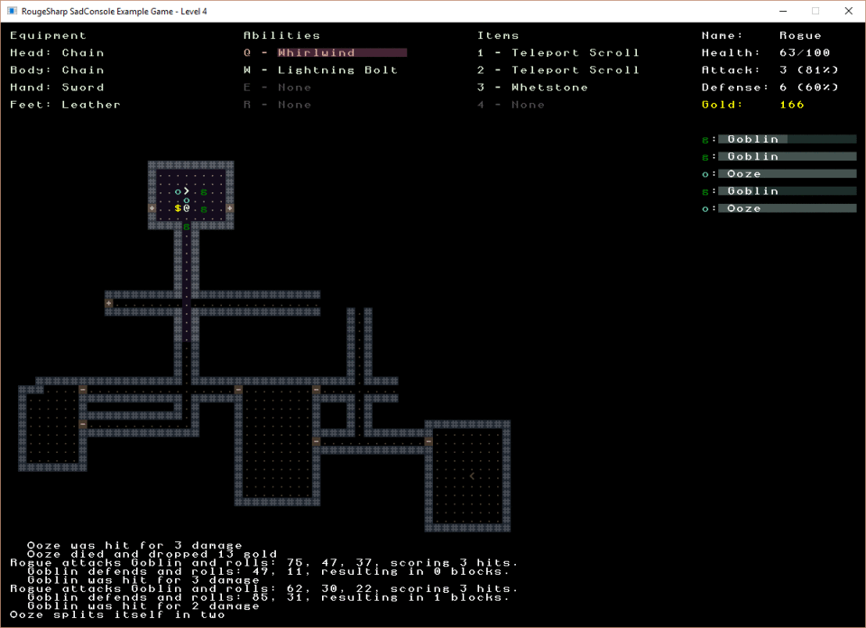
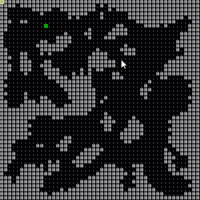
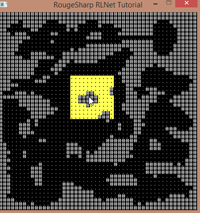
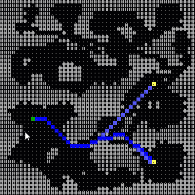
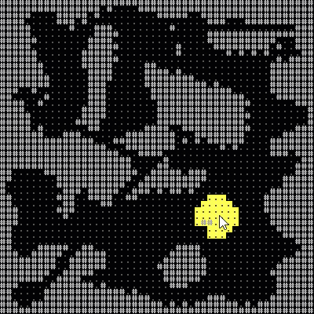

[](https://faronbracy.github.io/RogueSharp/articles/01_introduction.html)
[](https://faronbracy.github.io/RogueSharp/api/index.html)
[](https://roguesharp.wordpress.com/)
[](https://raw.githubusercontent.com/FaronBracy/RogueSharp/master/LICENSE.txt)

[](https://dreamersdesign.visualstudio.com/RogueSharp/_build/latest?definitionId=1) 
[](https://ci.appveyor.com/project/FaronBracy/roguesharp-20n28) 
[](https://www.nuget.org/packages/RogueSharp) 

[](https://dreamersdesign.visualstudio.com/RogueSharp/_build/latest?definitionId=1)
[](https://dreamersdesign.visualstudio.com/RogueSharp/_build/latest?definitionId=1)

[](https://ci.appveyor.com/project/FaronBracy/roguesharp-20n28/history)

[](https://github.com/FaronBracy/RogueSharpSadConsoleSamples)

- [Sample Game using RogueSharp with SadConsole](https://github.com/FaronBracy/RogueSharpSadConsoleSamples)
- [Sample Game using RogueSharp with RLNet](https://github.com/FaronBracy/RogueSharpRLNetSamples)

# What is RogueSharp? #
RogueSharp is a free library written in C# to help [roguelike](http://en.wikipedia.org/wiki/Roguelike "roguelike") developers get a head start on their game. RogueSharp provides many utility functions for dealing with map generation, field-of-view calculations, path finding, random number generation and more.

It is loosely based on the popular [libtcod](http://doryen.eptalys.net/libtcod/ "libtcod") or "Doryen Library" though not all features overlap.

## Getting Started ##
1. Visit the [RogueSharp Blog](https://roguesharp.wordpress.com/ "RogueSharp Blog") for tips and tutorials.
2. The quickest way to add RogueSharp to your project is by using the [RogueSharp nuget package](https://www.nuget.org/packages/RogueSharp "RogueSharp nuget package"). 
2. If building the assembly yourself, the solution file "RogueSharp.sln" contains the main library and unit tests. This should be all you need.
3. Class documentation is located on [Github Pages](https://faronbracy.github.io/RogueSharp/api/index.html "RogueSharp class documentation").

## Features ##

**Pathfinding**

With or without diagonals


```
/// Constructs a new PathFinder instance for the specified Map 
/// that will consider diagonal movement by using the specified diagonalCost
public PathFinder( IMap map, double diagonalCost )

/// Returns a shortest Path containing a list of Cells 
/// from a specified source Cell to a destination Cell
public Path ShortestPath( ICell source, ICell destination )
```

**Cell Selection**

Select rows, columns, circles, squares and diamonds with and without borders.


```
/// Get an IEnumerable of Cells in a circle around the center Cell up 
/// to the specified radius using Bresenham's midpoint circle algorithm
public IEnumerable<ICell> GetCellsInCircle( int xCenter, int yCenter, int radius )
  
/// Get an IEnumerable of outermost border Cells in a circle around the center 
/// Cell up to the specified radius using Bresenham's midpoint circle algorithm
public IEnumerable<ICell> GetBorderCellsInCircle( int xCenter, int yCenter, int radius )
```

**Weighted Goal Maps**

Set multiple goals weights for desirability. Add obstacles to avoid.



```
/// Constructs a new instance of a GoalMap for the specified Map 
/// that will consider diagonal movements to be valid if allowDiagonalMovement is set to true.
public GoalMap( IMap map, bool allowDiagonalMovement )

/// Add a Goal at the specified location with the specified weight
public void AddGoal( int x, int y, int weight )

/// Add an Obstacle at the specified location. Any paths found must not go through Obstacles
public void AddObstacle( int x, int y )
```

**Field-of-View**

Efficient field-of-view calulation for specified distance. Option to light walls or not.


```
/// Constructs a new FieldOfView objec for the specified Map
public FieldOfView( IMap map )

/// Performs a field-of-view calculation with the specified parameters.
public ReadOnlyCollection<ICell> ComputeFov( int xOrigin, int yOrigin, int radius, bool lightWalls )

/// Performs a field-of-view calculation with the specified parameters
/// and appends it any existing field-of-view calculations.
public ReadOnlyCollection<ICell> AppendFov( int xOrigin, int yOrigin, int radius, bool lightWalls )
```

## Creating a Map ##
Most interactions with RogueSharp is based around the concept of a `Map` which is a rectangular grid of `Cells`. 

Each `Cell` in a `Map` has the following properties:

- `IsTransparent`: true if visibility extends through the `Cell`.
- `IsWalkable`: true if a the `Cell` may be traversed by the player
- `IsExplored`: true if the player has ever had line-of-sight to the `Cell`
- `IsInFov`: true if the `Cell` is currently in the player's field-of-view

To instantiate a new `Map` you can use its constructor which takes a width and height and will create a new map of those dimensions with the properties of all `Cells` set to false.
    
### Usage ###

	IMap boringMapOfSolidStone = new Map( 5, 3 );
	Console.WriteLine( boringMapOfSolidStone.ToString() );

### Output ###

	#####
	#####
	#####

Notice that the `ToString()` operator is overridden on the `Map` class to provide a simple visual representation of the map. An optional bool parameter can be provided to `ToString()` to indicate if you want to use the field-of-view or not. If the parameter is not given it defaults to false. 

The symbols used are as follows:

- `%`: `Cell` is not in field-of-view
- `.`: `Cell` is transparent, walkable, and in field-of-view
- `s`: `Cell` is walkable and in field-of-view (but not transparent)
- `o`: `Cell` is transparent and in field-of-view (but not walkable)
- `#`: `Cell` is in field-of-view (but not transparent or walkable)

A more interesting way to create a map is to use the `Map` class's static method `Create` which takes an `IMapCreationStrategy`. Some simple classes implementing `IMapCreationStrategy` are provided with RogueSharp but this is easily extended by creating your own class that implements the strategy.

### Usage ###

	IMapCreationStrategy<Map> mapCreationStrategy = new RandomRoomsMapCreationStrategy<Map>( 17, 10, 30, 5, 3 )
	IMap somewhatInterestingMap = Map.Create( mapCreationStrategy );
	Console.WriteLine( somewhatInterestingMap.ToString() );

### Output ###

	#################
	#################
	##...#######...##
	##.............##
	###.###....#...##
	###...##.#####.##
	###...##...###..#
	####............#
	##############..#
	#################

## Credits ##

- [Doryen Library (libtcod)](http://doryen.eptalys.net/libtcod/ "libtcod")
	- This was a big inspiration for RogueSharp
	- The main RogueSharp library does not use any source code from libtcod, nor does it reference or depend on the libtcod library
	- [libtcod source code](https://bitbucket.org/jice/libtcod/src "libtcod source code")
	- [libtcod license](https://bitbucket.org/jice/libtcod/src/969e7cfdf44c2a8734957306b456ae0eb29ac8c4/LIBTCOD-LICENSE.txt?at=default "libtcod license")
- [MonoGame](http://www.monogame.net/ "MonoGame")
	- Similar Point and Rectangle classes are included in RogueSharp that are inspired by MonoGame
	- [MonoGame source code](https://github.com/mono/MonoGame "MonoGame")
	- [MonoGame license](https://github.com/mono/MonoGame/blob/develop/LICENSE.txt "MonoGame license")
- [Princeton University Java Algorithms](http://algs4.cs.princeton.edu/code/ "Java Algorithms - Princeton University")
	- Several classes from RogueSharps Algorithms namespace are inspired by these Algorithms
- [RogueBasin](http://www.roguebasin.com/ "RogueBasin")
	- [Articles of interest for Roguelike developers](http://www.roguebasin.com/index.php?title=Articles "Roguelike developer articles")
- [DocFx](https://github.com/dotnet/docfx "DocFx")
	- DocFx is used to automatically generate documentation from the XML comments in source code
	- [DocFx license](https://github.com/dotnet/docfx/blob/dev/LICENSE "DocFx license")
- [Certes DocFx Template](https://github.com/fszlin/certes "Certes DocFx Template")
	- The DocFx template I'm using is based on the template created by fszlin for the Certes client.
	- Note: RogueSharp itself doesn't actually use Certes
	- [Certes license](https://github.com/fszlin/certes/blob/master/LICENSE)
- [Dice Notation .NET](https://dicenotation.codeplex.com "Dice Notation .NET")
	- Significant portions of the code in RougeSharp DiceNotation namespace are taken directly from this great library
	- [Dice Notation .NET source code](https://dicenotation.codeplex.com/SourceControl/latest "Dice Notation .NET source code")
	- [Dice Notation .NET license](https://dicenotation.codeplex.com/license "Dice Notation .NET license")

## License ##

#### RogueSharp ####

MIT License

Copyright (c) 2014 - 2019 Faron Bracy

Permission is hereby granted, free of charge, to any person obtaining a copy
of this software and associated documentation files (the "Software"), to deal
in the Software without restriction, including without limitation the rights
to use, copy, modify, merge, publish, distribute, sublicense, and/or sell
copies of the Software, and to permit persons to whom the Software is
furnished to do so, subject to the following conditions:

The above copyright notice and this permission notice shall be included in all
copies or substantial portions of the Software.

THE SOFTWARE IS PROVIDED "AS IS", WITHOUT WARRANTY OF ANY KIND, EXPRESS OR
IMPLIED, INCLUDING BUT NOT LIMITED TO THE WARRANTIES OF MERCHANTABILITY,
FITNESS FOR A PARTICULAR PURPOSE AND NONINFRINGEMENT. IN NO EVENT SHALL THE
AUTHORS OR COPYRIGHT HOLDERS BE LIABLE FOR ANY CLAIM, DAMAGES OR OTHER
LIABILITY, WHETHER IN AN ACTION OF CONTRACT, TORT OR OTHERWISE, ARISING FROM,
OUT OF OR IN CONNECTION WITH THE SOFTWARE OR THE USE OR OTHER DEALINGS IN THE
SOFTWARE.

#### Other Licenses ####

See links to licenses in the credits for respective libraries